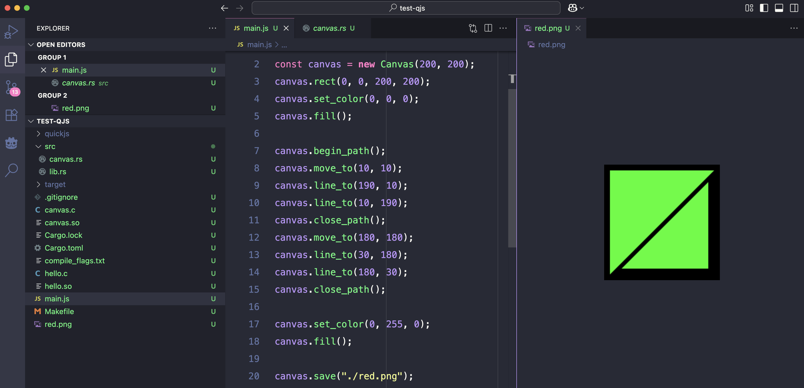

# 给quickjs写一个扩展，用rust

遥想当年，我曾经尝试过给node写一个C++扩展，过程虽然艰辛，但尚算顺利。

今天，我再次挑战自己，而这次，我决定给quickjs一个机会，不过这次我想尝试使用rust来实现这个扩展。废话不多少，先上文档

在quickjs的官方文档中，有这么一个关于模块的[章节](https://bellard.org/quickjs/quickjs.html#Modules)，其中对我们最重要的是第三点：

> Module names ending with .so are native modules using the QuickJS C API.

也就是说，quickjs允许我们使用他的C接口，编成一个.so文件，并且可以在js中import进来直接使用。这马上就让我联想起node的扩展，node的扩展同样是使用node.h中提供的接口，编成一个.node文件（在linux系统上，就是.so文件）。可见两者几乎是一脉相承的。

那接下来，很自然而然的，我打开了我的kitty，输入了：
```shell
$ wget https://bellard.org/quickjs/quickjs-2025-04-26.tar.xz
```

没错，我的电脑上没有quickjs😆，所以要先下载一下它的源码，接下来就是最关键的一步：
```shell
$ tar -xf quickjs-2025-04-26.tar.xz 
$ cd quickjs-2025-04-26
$ make
```

对，就是要编译quickjs，不然就没法开始了🐶。经过大概一分钟左右的时间，quickjs编译完成，在文件夹中会多出来一个`qjs`文件，这就是quickjs的解析器。接下里，我们回到项目目录，创建我们的扩展c文件：

```shell
$ cd ..
$ vim hello.c
```

并输入如下代码：
```c
#include <stdio.h>
#include "quickjs.h"

// export给js的hello函数
static JSValue js_hello(JSContext *ctx, JSValueConst this_val, int argc, JSValueConst *argv) {
    printf("hello world\n");
    return JS_UNDEFINED;
}

// 所有需要export的函数列表
static const JSCFunctionListEntry js_hello_funcs[] = {
    JS_CFUNC_DEF("hello", 0, js_hello)
};

// 模块初始化函数
static int js_hello_init(JSContext *ctx, JSModuleDef *m) {
    return JS_SetModuleExportList(ctx, m, js_hello_funcs, 1);
}

// 模块定义入口
JSModuleDef *js_init_module(JSContext *ctx, const char *module_name) {
    JSModuleDef *m;
    m = JS_NewCModule(ctx, module_name, js_hello_init);
    if (!m) {
        return NULL;
    }
    JS_AddModuleExportList(ctx, m, js_hello_funcs, 1);
    return m;
}
```

没错，我们用了整整28行代码，才写出来一个`hello world`模块，bravo❤️。

接下里，就需要编译这个c模块，我们需要一个`Makefile`文件：

```makefile
CFLAGS=\
	-shared\
	-undefined dynamic_lookup\
	-fPIC\
	-I./quickjs-2025-04-26

hello.so: hello.c
	gcc $(CFLAGS) -o hello.so hello.c
```

写过`Makefile`的同学们应该都知道，如果要编译一个动态连接库（.so文件），就需要给`gcc`两个参数`-shared -fPIC`，而由于我们用到了quickjs提供的头文件，我们还需要给`gcc`提供include路径`-I./quickjs-2025-04-26`，最后由于我的笔记本是一台mac，所以需要多加一个`-undefined dynamic_lookup`标志。

好，一切就绪，开`make`。一秒钟后，项目文件夹下就会多出来一个`hello.so`文件。这时候，就可以愉快的打开我们的js文件：

```shell
$ vim main.js
```

并且输入如下代码：
```javascript
import { hello } from './hello.so';
hello();
```

然后运行它：
```shell
$ ./quickjs-2025-04-26/qjs main.js
hello world
$
```

就是这么简单，呸～。

搞了这么久，我们还没有进入正题，我们的主角rust还没有出现。接下里我们直接在当前项目下创建一个rust的lib：
```shell
$ cargo init --lib
```

打开`src/lib.rs`文件，清掉它原本的内容，然后输入：
```rust
// 标注hello函数，遵循C-ABI
#[unsafe(no_mangle)]
pub extern "C" fn hello() {
    println!("hello from rust");
}
```

然后打开`Cargo.toml`文件，配置一下lib的名字和类型：
```toml
[lib]
name = "hello"
crate-type = ["staticlib"]
```

这里我们需要将rust编译成一个静态库，这样在执行`cargo build`之后，就会生成一个`libhello.a`文件。

这时候，我们再次回到我们的`hello.c`文件，修改如下内容：
```diff
-- #include <stdio.h>
   #include "quickjs.h"

++ void hello();

   static JSValue js_hello(JSContext *ctx, JSValueConst this_val, int argc, JSValueConst *argv) {
--     printf("hello world\n");
++     hello();
       return JS_UNDEFINED;
```

使用我们rust编写的`hello`函数，替换原来的`printf`。最后，我们改动一下`Makefile`，加入rust代码的部份，`Makefile`，修改如下内容：
```diff
-- hello.so: hello.c
--     gcc $(CFLAGS) -o hello.so hello.c 
++ hello.so: hello.c libhello.a
++     gcc $(CFLAGS) -o hello.so hello.c -L./target/release -lhello
++
++ libhello.a: src/lib.rs
++     cargo build --release
```

OK，开`make`。同样经过几秒钟左右的时间，新的`hello.so`文件就编译完成了，这时候，我们再执行一下我们的js：

```shell
$ ./quickjs-2025-04-26/qjs main.js
hello from rust
$
```

这样，你就可以在js中愉快的玩耍你的rust了，以上～

对了，最后我利用这个习得的技能，给quickjs实现了一个canvas，可以用来模拟浏览器中的canvas，以上～
