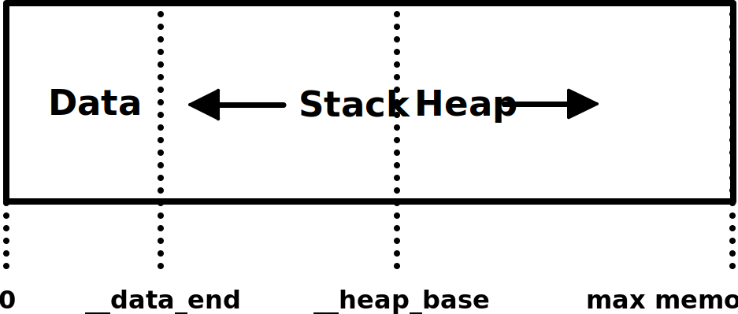

## 震惊，不使用Emscripten，居然也能把C编译成WebAssembly

> 最近在深入研究`@wasm/studio-utils`这样的WebAssembly编译工具时，发现了其内部并没有使用像Emscripten这样的工具，而是直接使用了LLVM进行编译。对此产生了兴趣，并发现了Surma的[这篇文章](https://surma.dev/things/c-to-webassembly/)，十分受用，于是翻译了一个中文的版本，希望能对大家有所启发。
>
> [原文] [Compiling C to WebAssembly without Emscripten](https://surma.dev/things/c-to-webassembly/)  
> [作者] Surma，Google工程师  
> [翻译] lizzzled


编译器其实只是Emscripten中很小的一部分，你有没有想过，其实我们可以只使用Emscripten中编译器的部分，即可完成从C到WebAssembly的编译？

Emscripten是一整套完善的编译器工具链，用于把C/C++编译成WebAssembly。但实际上它的功能远不止是编译。Emscripten的目标是要取代现有的C/C++编译器，使那些原本不是为web而写的代码，能直接在web平台上运行。为了实现这个目标，Emscripten模拟了整个POSIX操作系统。如果你在代码中使用了*fopen()*方法，那么Emscripten会把模拟文件系统相关的代码打包进你的目标文件。如果你使用了OpenGL，那么Emscripten就会基于*WebGL*实现一套兼容C下OpenGL上下文的接口，并把这套接口代码也打包到你的目标文件中。这些打包到你目标文件的代码很大很复杂，需要额外的带宽才能下载到浏览器中运行。但你真的需要这些吗？

在Emscripten工具链中，负责把C编译成WebAssembly的编译器名叫*LLVM*。LLVM是一个现代模块化的编译器框架。所谓的模块化，指的是LLVM不会把某种语言直接编译成机器码，而是把整个编译过程分成了编译的前端和编译的后端。前端的部分负责把某种语言编译成一种特殊的中间表示（IR），是一种针对名叫*L*ow-*l*evel *V*irtual *M*achine的虚拟机而生成的特殊编码，因此这种中间表示也称为LLVM（同时LLVM也是该项目的名称）。而后端的部分则负责把这种中间表示转换成机器码。这样严格区分前后端的好处是，当需要支持一种新的系统架构时，只需增加一个新的编译后端即可。WebAssembly，就是众多LLVM支持的编译目标之一。在之前的LLVM版本中，对WebAssembly的支持还只是实验性质，你可以通过设置特殊的标志位将WebAssembly指定为编译目标。而在8.0版本后，LLVM正式支持WebAssembly。如果你使用的是MacOS系统，可以通过*homebrew*来安装最新版的LLVM：

```bash
$ brew install llvm
$ brew link --force llvm
```

为了确认LLVM是否已经支持WebAssembly，可以通过下面的命令查看后端编译器所支持的编译目标：

```bash
$ llc --version
LLVM (http://llvm.org/):
  LLVM version 8.0.0
  Optimized build.
  Default target: x86_64-apple-darwin18.5.0
  Host CPU: skylake

  Registered Targets:
    # … OMG LLVM居然支持这么多种编译目标 …
    systemz    - SystemZ
    thumb      - Thumb
    thumbeb    - Thumb (big endian)
    wasm32     - WebAssembly 32-bit # 🎉🎉🎉
    wasm64     - WebAssembly 64-bit
    x86        - 32-bit X86: Pentium-Pro and above
    x86-64     - 64-bit X86: EM64T and AMD64
    xcore      - XCore
```

嗯，看起来一切正常。

### 在困难模式下，编译C

> 注意：接下来我们将会直接查看一些像WebAssembly原始文本格式这样的底层文件格式。如果你感觉到阅读有点困难，也不需要太过担心，对于简单使用WebAssembly来说，你并不需要理解这篇文章的所有内容。而如果你只是希望能复制一些有用的代码，可以直接跳到“优化”的部分接着往下看。但如果你对WebAssembly抱有浓厚的兴趣，那我们就继续吧。我在之前的文章中有关于WebAssembly原始文本格式的介绍，当中包含了能帮助你理解本篇文章所需掌握的一切基础知识。

温馨提示：我会尽我所能的使用可读性更好的方式来表达接下来的每一个步骤。而且为了避开一些复杂的情况，在接下里的过程中我们所使用到的程序都是超级简单，这样更有利于我们集中精力在编译的部分。

```c
// Filename: add.c
int add(int a, int b) {
  return a * a + b;
}
```

这样的代码是不是感觉超级“厉害”！特别是那个看着一点都不像加法的“add”方法。不过更重要的一点是，这段代码，并没有用到C中的标准库，而且仅仅只使用了`int`这种数据类型。

#### 把C编译成LLVM的中间表示

第一步，我们首先要把C编译成LLVM的中间表示，这部分由前端编译器*clang*来完成，在安装LLVM的时候，clang已经包含其中：

```bash
clang \
  --target=wasm32 \ # 指定WebAssembly作为编译目标
  -emit-llvm \ # 生成LLVM的中间表示，而不是直接生成机器码
  -c \ # 只需要进行编译, 不需要链接
  -S \ # 生成可读性更好的汇编代码，而不是直接生成二进制代码
  add.c
```

通过上面的命令，我们可以得到一个包含LLVM中间表示的*add.ll*文件。__为了完整性，这里我展示一下文件中的内容__。而在实际进行WebAssembly编译的时候，或者是使用*clang*来编译C的时候，你是不会直接接触到LLVM的中间表示的。

```llvm
; ModuleID = 'add.c'
source_filename = "add.c"
target datalayout = "e-m:e-p:32:32-i64:64-n32:64-S128"
target triple = "wasm32"

; Function Attrs: norecurse nounwind readnone
define hidden i32 @add(i32, i32) local_unnamed_addr #0 {
  %3 = mul nsw i32 %0, %0
  %4 = add nsw i32 %3, %1
  ret i32 %4
}

attributes #0 = { norecurse nounwind readnone "correctly-rounded-divide-sqrt-fp-math"="false" "disable-tail-calls"="false" "less-precise-fpmad"="false" "min-legal-vector-width"="0" "no-frame-pointer-elim"="false" "no-infs-fp-math"="false" "no-jump-tables"="false" "no-nans-fp-math"="false" "no-signed-zeros-fp-math"="false" "no-trapping-math"="false" "stack-protector-buffer-size"="8" "target-cpu"="generic" "unsafe-fp-math"="false" "use-soft-float"="false" }

!llvm.module.flags = !{!0}
!llvm.ident = !{!1}

!0 = !{i32 1, !"wchar_size", i32 4}
!1 = !{!"clang version 8.0.0 (tags/RELEASE_800/final)"}
```

从文件的内容可以看出来，LLVM的中间表示中包含许多元数据和注解，这些信息能帮忙后端编译器在生成机器代码的时候，作出更好的决策。

#### 把LLVM中间表示编译成目标文件

下一步，我们会使用LLVM的后端编译器*llc*，把LLVM中间表示编译成目标文件：

```bash
llc \
  -march=wasm32 \ # 指定WebAssembly作为编译目标
  -filetype=obj \ # 输出目标文件
  add.ll
```

输出的目标文件*add.o*，实际上已经是一个有效的WebAssembly模块，当中包含了所有从C编译过来的代码。不过大部分的情况下，这些目标文件会因为缺少一些必要的部分而无法直接运行。

如果去掉命令行中的-*filetype=obj*参数，我们就可以得到一个LLVM针对WebAssembly的汇编格式文件，这种格式是一种可读格式，类似WebAssembly中的WAT。不过用于处理这类文件格式的*llvm-mc*工具还不能完整支持这种格式，会经常出现处理失败的情况。所以这里我们选择生成目标文件，而接下来，我们会对生成的目标文件进行分析。目标文件顾名思义是针对特定目标而生成的，因此也需要针对特定目标的工具来解析。对于WebAssembly来说，使用的工具就是*wasm-objdump*，这个工具包含在*WebAssembly Binary Tookit*工具包（简称wabt）中。

```bash
$ brew install wabt # 如果没有安装wabt，可以通过brew来安装
$ wasm-objdump -x add.o

add.o:  file format wasm 0x1

Section Details:

Type[1]:
 - type[0] (i32, i32) -> i32
Import[3]:
 - memory[0] pages: initial=0 <- env.__linear_memory
 - table[0] elem_type=funcref init=0 max=0 <- env.__indirect_function_table
 - global[0] i32 mutable=1 <- env.__stack_pointer
Function[1]:
 - func[0] sig=0 <add>
Code[1]:
 - func[0] size=75 <add>
Custom:
 - name: "linking"
  - symbol table [count=2]
   - 0: F <add> func=0 binding=global vis=hidden
   - 1: G <env.__stack_pointer> global=0 undefined binding=global vis=default
Custom:
 - name: "reloc.CODE"
  - relocations for section: 3 (Code) [1]
   - R_WASM_GLOBAL_INDEX_LEB offset=0x000006(file=0x000080) symbol=1 <env.__stack_pointer>
```

从输出里，我们可以看到WebAssembly模块中已经包含了我们的*add()*函数，但同时也包含了一些充满元数据的*custom*段，以及，令人惊讶的是，*import*段中还包含多个import数据。而在接下来*链接*阶段，这些*costum*段会被进一步分析和消除，*连接器*也会负责把*import*段中的import数据与具体的地址进行关联。

#### 链接

一般来说，链接器的工作是把多个目标文件链接在一起生成可执行文件。LLVM中的链接器名叫*lld*，但它需要由针对特定目标的软链来调用。对于WebAssembly来说，这个软链就是*wasm-ld*。

```bash
wasm-ld \
  --no-entry \ # 我们的代码不包含入口函数
  --export-all \ # 导出所有的函数
  -o add.wasm \
  add.o
```

上面的命令，输出的是一个大小为262bytes的WebAssembly模块。

#### 运行

当然，对于我们来说，最重要的还是要看看这些代码是否能真正的运行起来。正如我在之前的博文中所说的那样，我们可以通过几行Javascript代码来加载并且运行这个WebAssembly模块。

```html
<!DOCTYPE html>

<script type="module">
  async function init() {
    const { instance } = await WebAssembly.instantiateStreaming(
      fetch("./add.wasm")
    );
    console.log(instance.exports.add(4, 1));
  }
  init();
</script>
```

如果一切正常的话，我们应该可以在浏览器开发者工具的console面板中看到17这样的输出。__恭喜！我们刚刚已经成功的在不使用Emscripten的情况下，把C编译成了WebAssembly__。同时值得注意的是，我们也不需要任何胶水代码来加载和运行WebAssembly模块。

### 在简单模式下，编译C

刚刚我们所使用到的，把C编译成WebAssembly的方法，确实有点让人望而却步。但正如我所说的，这一切都只是出于教学的目的。实际上，我们大可以跳过这些繁复的中间步骤，直接把C编译器当成瑞士军刀，一步到位：

```bash
clang \
  --target=wasm32 \
  -nostdlib \ # 无需链接任何的标准库
  -Wl,--no-entry \ # 透传给链接器的标志
  -Wl,--export-all \
  -o add.wasm \
  add.c
```

上面这个命令，同样也能生成和之前相同的.*wasm*文件，但这里我们只需要一条命令即可。

### 优化

接下来，我们使用*wasm2wat*工具，把WebAssembly模块转换成WAT格式：

```wasm
(module
  (type (;0;) (func))
  (type (;1;) (func (param i32 i32) (result i32)))
  (func $__wasm_call_ctors (type 0))
  (func $add (type 1) (param i32 i32) (result i32)
    (local i32 i32 i32 i32 i32 i32 i32 i32)
    global.get 0
    local.set 2
    i32.const 16
    local.set 3
    local.get 2
    local.get 3
    i32.sub
    local.set 4
    local.get 4
    local.get 0
    i32.store offset=12
    local.get 4
    local.get 1
    i32.store offset=8
    local.get 4
    i32.load offset=12
    local.set 5
    local.get 4
    i32.load offset=12
    local.set 6
    local.get 5
    local.get 6
    i32.mul
    local.set 7
    local.get 4
    i32.load offset=8
    local.set 8
    local.get 7
    local.get 8
    i32.add
    local.set 9
    local.get 9
    return)
  (table (;0;) 1 1 anyfunc)
  (memory (;0;) 2)
  (global (;0;) (mut i32) (i32.const 66560))
  (global (;1;) i32 (i32.const 66560))
  (global (;2;) i32 (i32.const 1024))
  (global (;3;) i32 (i32.const 1024))
  (export "memory" (memory 0))
  (export "__wasm_call_ctors" (func $__wasm_call_ctors))
  (export "__heap_base" (global 1))
  (export "__data_end" (global 2))
  (export "__dso_handle" (global 3))
  (export "add" (func $add)))
```

好吧，这里生成的WAT代码貌似有点多。令我感到惊讶的是，模块中使用到了memory（代码中包含了*i32.load*和*i32.store*操作，这些都是作用于memory），还有足足有8个之多的本地变量，以及其他的一些全局变量。老子徒手撸的代码，也比这个版本要简练。不过之所以这个程序会如何之大，是由于我们还没有开启优化选项。就像这样：

```diff
 clang \
   --target=wasm32 \
+  -O3 \ # 进一步优化
+  -flto \ # 加入一些用于链接阶段的优化参数
   -nostdlib \
   -Wl,--no-entry \
   -Wl,--export-all \
+  -Wl,--lto-O3 \ # 进一步对链接阶段的优化
   -o add.wasm \
   add.c
```

> 注意：从技术上来说，对于我们这里只有一个源文件的情况，链接阶段的优化并不会带来任何的收益。但在一些更大的项目中，LTO优化的确能有效的减少生成的文件大小。

在运行了上面这个命令之后，我们的.*wasm*文件从原来的262bytes下降到197bytes，而相应的WAT文件也简练了许多：

```wasm
(module
  (type (;0;) (func))
  (type (;1;) (func (param i32 i32) (result i32)))
  (func $__wasm_call_ctors (type 0))
  (func $add (type 1) (param i32 i32) (result i32)
    local.get 0
    local.get 0
    i32.mul
    local.get 1
    i32.add)
  (table (;0;) 1 1 anyfunc)
  (memory (;0;) 2)
  (global (;0;) (mut i32) (i32.const 66560))
  (global (;1;) i32 (i32.const 66560))
  (global (;2;) i32 (i32.const 1024))
  (global (;3;) i32 (i32.const 1024))
  (export "memory" (memory 0))
  (export "__wasm_call_ctors" (func $__wasm_call_ctors))
  (export "__heap_base" (global 1))
  (export "__data_end" (global 2))
  (export "__dso_handle" (global 3))
  (export "add" (func $add)))
```

### 调用C标准库

现阶段，没有标准库（例如libc）支持的C代码功能是很弱的。理论上，下一步我们应该要加入对C标准库的支持，但老实说，这并没有想象中的简单。__而事实上我也没有打算在这篇文章中加入链接标准库的相关代码__。市面上有多个C标准库的实现供大家选择，其中比较常见的有*glibc*，*musl*还有*dietlibc*。然而这些库或多或少的都假定运行环境为一个POSIX操作系统，而这些系统都提供了完整的*系统调用*（调用系统内核代码）。但在Javascript环境中并没有直接提供这样的内核接口，我们需要自己动手实现这样的POSIX系统调用，而有些接口功能仅仅使用Javascript甚至根本无法实现。不过幸运的是，__这些*Emscripten*都给你做好了__。

当然，并不是所有的标准库函数都依赖于系统调用，像*strlen()*，*sin()* 还有*memset()* 这样的函数，都是纯C的实现。这意味这你可以直接使用这些函数，甚至是把它们从其中之一的标准库实现中复制到你的代码来。

### 动态内存分配

没有了标准库的支持，有些像*malloc()* 和*free()* 这样的基础C函数就不能用了。在那个没有经过优化的WAT版本中，我们可以看到，在必要的时候编译器是会使用到内存的，这也就意味这，如果我们直接去操作内存肯定会遇到风险。因此我们需要了解，WebAssembly中内存的正确使用方式。

#### LLVM的内存模型

在WebAssembly中，内存的分段方式是由*wasm-ld*指定的，对于一个C语言老手来说，可能会有些不习惯。首先，从技术上来说，地址0在WebAssembly中是合法的地址，不过在一部分C代码中，这会被当作错误来处理（例如内存分配失败，返回NULL，而NULL就是地址0）。其次，栈排在内存中靠前的位置，并且向地址值减少的方向增长，而堆则排在内存中靠后的位置，并且向地址值增加的方向增长。这主要是由于WebAssembly的内存大小是可以在运行时动态追加的，也就意味着，栈和堆都没有所谓的固定大小限制。

*wasm-ld*所使用到的内存布局如下：  
  
栈往地址值减少的方向增长，堆往地址值增加的方向增长。从_*_data_end*指针开始的是属于栈的部分，而从_*_heap_base*指针开始的是属于堆的部分。因为栈放在内存中靠前的位置，因此它的最大内存占用是在编译时决定的，大小为_*_heap_base - __data_end*。

如果我们看回之前WAT中的global段代码，我们轻易就能找到这些指针变量的定义。_*_heap_base*为66560，而_*_data_end*为1024。这意味则栈最多只能占用64Kib的内存空间，这是远远不够的。幸运的是，我们可以通过*wasm-dl*来调整这些值：

```diff

 clang \
   --target=wasm32 \
   -O3 \
   -flto \
   -nostdlib \
   -Wl,--no-entry \
   -Wl,--export-all \
   -Wl,--lto-O3 \
+  -Wl,-z,stack-size=$[8 * 1024 * 1024] \ # 设置栈的最大内存空间占用为8MiB
   -o add.wasm \
   add.c
```

#### 编写一个内存分配器

现在我们已经知道堆的起始地址是由_*_heap_base*来指定的，而由于没有实现*malloc()*函数，因此我们是可以随意去操作这段内存空间的。我们可以在这段内存的任意位置存放数据，而不用担心会与栈操作发生冲突（栈的增长方向和堆的增长方向是相反的）。不过如果我们真的手动去操作这段内存，那很快我们就会举步难行，因此我们还是需要引入一些必要的动态内存管理。我们可以使用像*Doug Lea`s开发的malloc实现*这样的库来完成动态内存管理，就像Emscripten那样。当然我们也可以选择其他更小的实现，这需要按照实际情况来权衡。

而事实上，你也可以选择自己实现一个*malloc()*函数。这正是我们接下来要做的。其中最最简单的实现是一个bump allocator。这样的实现优点是性能好，而且代码量十分少，容易实现。不过缺点是你不能释放已分配的内存。第一眼看上去，这完全不可用啊，不过后来我却发现，在一些像*Squoosh*这样的特殊的场景下，bump allocator是一个极好的选择。bump allocator的原理简单来说，是把待分配的内存起始地址保存在一个全局变量中。当程序请求n bytes内存空间时，我们把这个全局的变量向前移动n位，并且把之前的值返回给程序：

```c
extern unsigned char __heap_base;

unsigned int bump_pointer = &__heap_base;
void* malloc(int n) {
  unsigned int r = bump_pointer;
  bump_pointer += n;
  return (void *)r;
}

void free(void* p) {
  // lol
}
```

*wasm-dl*在WAT的global段中定义的全局变量，我们是可以当作普通全局变量一样，直接在C代码中访问的（要加上*extern*关键字来标记）。__😱看到了吗？我们刚刚只使用了5行代码，就实现我们自己的*malloc()* 函数__。

> 注意：我们实现的bump allocator与C标准库中的malloc函数并不完全兼容。例如，我们并没有实现内存对齐相关的能力。但对于我们这里的情况来说，已经足够了。

#### 使用动态内存

为了证明这段代码能正常工作，我们来编写一个C函数，这个函数有一个具有任意长度的整数数组作为参数，而我们需要计算出这个数组中所有整数之和。看起来没有很吸引，但确认需要用到动态内存，因为我们在编译时并不知道数组的长度，它需要在运行时动态分配：

```c
int sum(int a[], int len) {
  int sum = 0;
  for(int i = 0; i < len; i++) {
    sum += a[i];
  }
  return sum;
}
```

这个*sum()* 函数十分的直观明了。但问题是，我们如何才能把一个数组从Javascript中传递到WebAssembly里呢？毕竟WebAssembly只能看得懂数字。一般的方法是通过在Javascript中直接调用*malloc()* 函数，分配一块可用的内存，把需要参与计算的数字复制到这块内存中，并把内存的起始地址作为指针变量传入WebAssembly（在C中指针和数组在函数调用的情况下是等价的）：

```html
<!DOCTYPE html>

<script type="module">
  async function init() {
    const { instance } = await WebAssembly.instantiateStreaming(
      fetch("./add.wasm")
    );

    const jsArray = [1, 2, 3, 4, 5];
    // 为5个32bit的整数分配内存
    // 并且返回内存的起始地址
    const cArrayPointer = instance.exports.malloc(jsArray.length * 4);
    // 把分配得到的一系列32bit整数内存空间转换
    // 成一个Uint32Array，其起始地址就是刚刚分配所得的地址
    const cArray = new Uint32Array(
      instance.exports.memory.buffer,
      cArrayPointer,
      jsArray.length
    );
    // 把所有需要参与计算的值从JS复制到C中
    cArray.set(jsArray);
    // 运行sum()函数，把起始地址和数组长度作为参数传入
    console.log(instance.exports.sum(cArrayPointer, cArray.length));
  }
  init();
</script>
```

当运行这段代码时，你应该可以在浏览器开发者工具的console面板中愉快地看到15这样的输出。这正是1到5之间所有整数之和。

### 总结

终于来到最后的总结部分了。再次恭喜你，如果你还是感觉无法完全消化全部内容，不用担心：__你可以跳过那些章节，要成为一个好的web开发者或者是熟练地使用WebAssembly并不需要完全理解全部内容__。但我还是希望与你分享这些内容，它们能使你明白和感谢像*Emscripten*这样的工具为你所做的一切。同时，这也让我明白，一个能正常工作的WebAssembly计算模块可以有多小。刚刚那个用于计算数组之和的wasm模块只有230bytes，__其中已经包含了一个能实现动态内存分配的bump allocator__。同样的代码，如果使用Emscripten来编译会生成100bytes的WebAssembly代码，以及11K的Javascript胶水代码。这篇文章的内容很多，但总会有它用得着的地方。