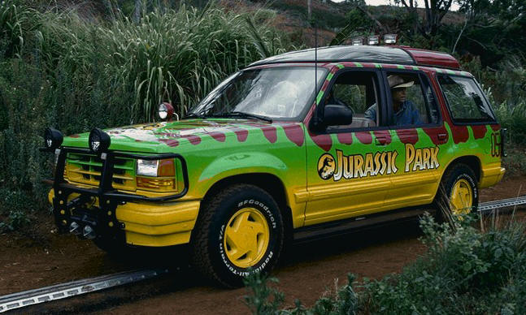
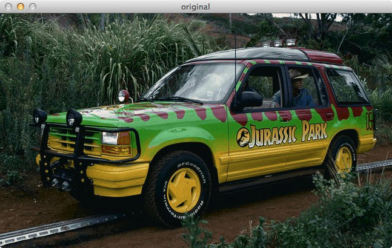
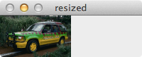
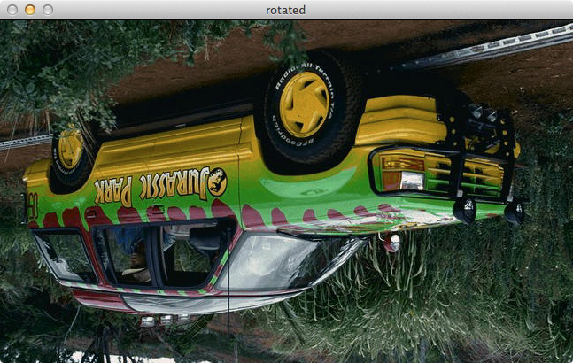
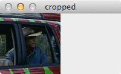
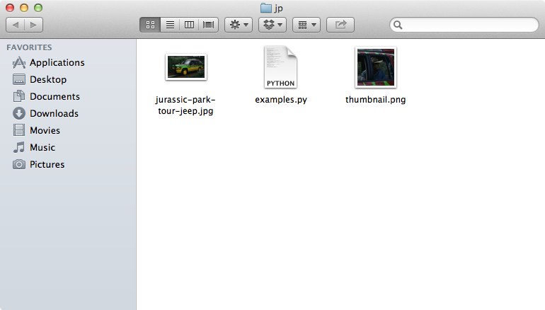

> 该文章为[pyimagesearch.com](http://www.pyimagesearch.com)上[Basic Image Manipulations in Python and OpenCV: Resizing (scaling), Rotating, and Cropping](http://www.pyimagesearch.com/2014/01/20/basic-image-manipulations-in-python-and-opencv-resizing-scaling-rotating-and-cropping/)的翻译，该网站还有很多很不错的关于Python和OpenCV的文章，在此给大家安利一下

你已经准备好开发属于自己的第一个图像搜索引擎了吗？不过在此之前，我们先来了解一些基本的图像处理技巧，这些基本的技巧会在之后的开发中变得非常有用。如果你已经是一个图像处理的达人，那么这篇文章对你来说可能会很无聊，但也希望你无论如何都读一下这篇文章，一定会有意外的收获的。

下面的代码，都是运行在Python2.7和OpenCV 2.4.X/OpenCV 3.0+环境。

在介绍基本的图像处理技巧之前，我会假设你已经掌握了如何创建和运行Python代码。我也会假设你已经正确安装了OpenCV，如果你还不知道如何安装OpenCV，可以参考OpenCV官网上的[这篇](http://opencv.org/quickstart.html)文章。

基于我对《侏罗纪公园》这部电影的迷恋，这次我们仍然会使用出现在电影里的这辆吉普车作为例子。

<br>
图一 例子中使用到的吉普车

你可以把图片下载到你的电脑中备用。接下来我们要开始编写一些Python和OpenCV的代码了。

你准备好了吗？那我们就开始吧。

首先我们要把图片加载到内存中，并显示在屏幕上：

```python
# 加载所需要的包
import cv2

# 加载图片并显示
image = cv2.imread("jurassic-park-tour-jeep.jpg")
cv2.imshow("original", image)
cv2.waitKey(0)
```

当我们运行上面这段Python代码，我们会得到如下结果：

<br>
图二 加载并显示吉普车的图片

正如你所看到的，图片已经正确的显示在屏幕上。接下来我们需要解析一下这段代码：

* 第一行，我们在Python中加载了OpenCV包
* 第五行，我们把图片加载到内存中，`imread`函数会返回一个NumPy数组，用于表示图片的内存引用
* 第六，七行，调用`imshow`函数把图片显示在屏幕上，第一个参数是一个字符串，用于表示打开窗口的“名字”，第二个参数是我们在第五行代码中加载到内存里的图片引用。最后，调用了`waitKey`函数，这样程序就会一直处于等待状态，直到我们按下键盘上的任意键。这里输入0作为参数，代表等待任意键。

仅仅是加载和显示图片还是很无趣。接下来，我们会对图片进行缩放，使它变小。由于图片是一个NumPy数组，因此我们可以通过`shape`属性来获取图片的宽高。

```python
print image.shape
```

当我们执行上面的代码，控制台中就会输出`(388, 647, 3)`，这代表图片包含有388行，647列像素，而每个像素则由RGB3个通道组成。通常，当我们要表示一个矩阵时，都会使用多少行x多少列的形式。这和NumPy数组的表示形式是一致的。

然而，当我们需要处理的是图片时，上述的表示形式却会使我们感到困惑，这是由于我们一般表示图片的尺寸，都是使用宽x高的形式。当我们看到上述的矩阵表示时，会下意识的认为图片的宽为388像素，高为647像素。然而这是错误的。实际上我们的图片是647像素宽，388像素高，也就是说，图片的高，是矩阵的行数，而图片的宽则是矩阵的列数。在我们刚开始接触OpenCV时，这会使我们感到困惑，花点时间来适用。

现在我们已经知道图片的宽度为647像素，接下来，我们把图片缩放为100像素宽：

```python
# 在缩放图片时我们需要留意图片的宽高比
# 这样图片在缩放的过程才不会变形，因此，
# 我们首先需要计算出缩放前后的图片比例
r = 100.0 / image.shape[1]
dim = (100, int(image.shape[0] * r))

# 真正的缩放图片，并且把结果显示在屏幕上
resized = cv2.resize(image, dim, interpolation = cv2.INTER_AREA)
cv2.imshow("resized", resized)
cv2.waitKey(0)
```

执行上面的代码，我们会得到一个经过缩放的宽为100像素的图片：

<br>
图三 经过缩放的，宽为100像素的图片

接下来，我们解析一下上面的代码：

* 第四，五行，在缩放的过程中，我们需要保持图片的宽高比。在这个例子中，我们需要把图片缩放到100像素宽，因此我们首先需要计算出缩放前后的图片尺寸比例`r`。接下来我们使用100像素作为缩放后图片的宽，`r`x缩放前图片的高度作为缩放后图片的高。这样做，我们就可以保持图片的宽高比。
* 第八至十行，这里我们真正的进行图片的缩放操作。`resize`函数的第一个参数为需要缩放的图片引用，第二个参数缩放后图片的尺寸，第三个参数，是图片缩放所使用到的插值算法。现阶段我们不用太过关注什么是插值算法。最后我们把缩放后的图片显示在屏幕上，并等待按下任意键退出。

对图片进行缩放感觉很不错。接下来我们要化身《侏罗纪公园》里的霸王龙，我们需要把吉普车反个底朝天：

```python
# 获取图片的尺寸
# 并计算出图片的中心坐标
(h, w) = image.shape[:2]
center = (w / 2, h / 2)

# 旋转图片180度
M = cv2.getRotationMatrix2D(center, 180, 1.0)
rotated = cv2.warpAffine(image, M, (w, h))
cv2.imshow("rotated", rotated)
cv2.waitKey(0)
```

现在你猜我们的吉普车变成什么样了？你猜对了，吉普车被反个底朝天了：

<br>
图四 吉普车被反转，你也可以使吉普车以任意角度旋转

这是到现在为止，我们实现的最复杂的例子了，接下来我们解析一下上面的代码：

* 第三行，为了方便之后的计算，我们把图片的宽高保存到相应的变量中
* 第四行，计算出图片的中心坐标，这里我们只是简单的把图片的宽高除以2
* 第七行，计算出用于对图像进行旋转（缩放）操作的变换矩阵。`getRotationMatrix2D`方法的第一个参数为我们之前获得的图片的中心坐标。如果你希望图片围绕其他点进行旋转，你也可以提供其他点的坐标作为第一个参数。第二个参数是旋转的角度，单位为度。第三个参数是缩放的比例，这里我们使用1.0作为第三个参数，亦即我们对图片不进行缩放。如果你希望把图片缩小为原来的一半，你可以把第三个参数设置为0.5。同样，如果你希望把图片放大为原来的一倍，你可以把第三个参数设置为2.0。
* 第八行，指定需要进行旋转的图片，表示旋转的变化矩阵，还有旋转后图片的尺寸，进行实际的旋转操作。
* 第九，十行，在屏幕上显示旋转后的图片。

到现在为止，旋转一幅图片已经是我们所接触的最复杂的图像处理技术了。

接下来，我们要尝试裁剪我们的图片，给Grant一个特写：

```python
# 使用数组切片对图片进行裁剪，记住
# 这是一个NumPy数组
cropped = image[70:170, 440:540]
cv2.imshow("cropped", cropped)
cv2.waitKey(0)
```

让我们来看看Grant，他像不像正在观察一只生病的三角龙？

<br />
图五 在Python和OpenCV中进行图片裁剪，是十分容易的，我们仅仅需要对NumPy数组进行切片操作

图片裁剪操作在Python和OpenCV中已经被NumPy数组的切片操作所替代。我们只需要提供起始y坐标和终止y坐标，还有起始x坐标和终止x坐标，就可以完成图片的裁剪操作。就是这么简单！

作为最后一个例子，让我们来尝试以PNG格式保存一张图片到硬盘中（图片的原始格式为JPG）：

```python
cv2.imwrite("thumbnail.png", cropped)
```

我们只需要提供图片保存的路径（第一个参数），以及所需保存的图片引用（第二个参数），即可完成图片的保存操作。十分的简单。

<br />
图六 我们已经把图片以"thumbnail.png"作为文件名保存在硬盘中

正如你所看到的，OpenCV会自动完成图片格式的转换。

这就是今天所有要说的内容。使用Python和OpenCV进行图像的基本操作。你可以根据自己的想法继续修改这些代码。

以上！