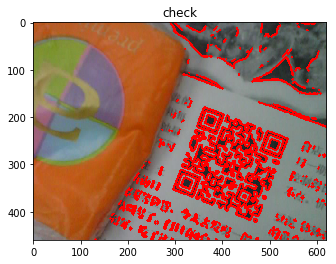

```python
import numpy as np
import matplotlib.pyplot as plt
import cv2
```


```python
def imshow_rgb(title, img):
    plt.title(title)
    plt.imshow(cv2.cvtColor(img, cv2.COLOR_BGR2RGB))
    plt.show()
    
def imshow_gs(title, img):
    plt.title(title)
    plt.imshow(img, cmap='gray')
    plt.show()
```


```python
img = cv2.imread('timg4.jpg')
# img = cv2.resize(img, (1000,1000), interpolation=cv2.INTER_CUBIC)
imshow_rgb('original', img)
```


```python
img_gs = cv2.cvtColor(img, cv2.COLOR_BGR2GRAY)
imshow_gs('grayscale', img_gs)
```


```python
roi_gs = img_gs[:,:]
imshow_gs('roi_gs', roi_gs)

_, roi_thresh = cv2.threshold(roi_gs, 120, 255, cv2.THRESH_BINARY)
imshow_gs('roi_thresh', roi_thresh)
```


```python
roi = img[:,:]
imshow_rgb('roi_rgb', roi)
```


```python
roi_blur = cv2.GaussianBlur(roi_gs, (3, 3), 1)
imshow_gs('gaussian', roi_blur)
```


```python
roi_edge = cv2.Canny(roi_blur, 100, 100)
imshow_gs('edage', roi_edge)
```


```python
_, contours, hierarchy = cv2.findContours(roi_edge, cv2.RETR_TREE,cv2.CHAIN_APPROX_SIMPLE)

roi_tmp = roi.copy()

for i in range(len(contours)):
    cv2.drawContours(roi_tmp, contours, i, (0, 0, 255), 3)
    
imshow_rgb('check', roi_tmp)
```


```python
hierarchy = hierarchy[0]
found = []

for i in range(len(contours)):
    k = i
    c = 0
    
    while hierarchy[k][2] != -1:
        k = hierarchy[k][2]
        c += 1
        
    if c >= 5:
        found.append(i)

print(found)
```

    [363, 429, 470]
    


```python
roi_tmp = roi.copy()

for i in found:
    cv2.drawContours(roi_tmp, contours, i, (0, 255, 0), 3)

imshow_rgb('check', roi_tmp)
```


```python
boxes = []

for i in found:
    rect = cv2.minAreaRect(contours[i])
    box = cv2.boxPoints(rect)
    box = np.int0(box)
    boxes.append(box)
    
print(boxes)
```

    [array([[347, 379],
           [304, 363],
           [320, 320],
           [363, 336]], dtype=int64), array([[531, 298],
           [487, 281],
           [503, 238],
           [547, 254]], dtype=int64), array([[396, 246],
           [354, 230],
           [370, 188],
           [412, 204]], dtype=int64)]
    


```python
import math

def distance(pt1, pt2):
    return math.sqrt(np.sum((pt1 - pt2) ** 2))

def find_shortest(box1, box2):
    t1 = t2 = None
    d1 = d2 = np.iinfo('i').max
    
    for pt1 in box1:
        for pt2 in box2:
            d = distance(pt1, pt2)
            t = (pt1, pt2)
            
            if d < d2:
                if d < d1:
                    t1, t2 = t, t1
                    d1, d2 = d, d1
                else:
                    t2 = t
                    d2 = d
                    
    pt1, pt2 = t1
    pt3, pt4 = t2
    
    r1 = (pt1 - pt3) // 12
    r2 = (pt2 - pt4) // 12
    
    pt1 = pt1 - r1
    pt3 = pt3 + r1
    pt2 = pt2 - r2
    pt4 = pt4 + r2
    
    return pt1, pt2, pt3, pt4
```


```python
pts = find_shortest(boxes[1], boxes[2])

roi_tmp = roi.copy()

for pt in map(tuple, pts):
    cv2.circle(roi_tmp, pt, 3, (0, 0, 255), 3)
    
imshow_rgb('points', roi_tmp)
```


```python
def check_timing(img, pt1, pt2):
    step = 20
    rate = (pt1 - pt2) // step
    line = []
    
    if np.sum(rate) == 0:
        return False
    
    for i in range(step):
        x, y = pt2 + i * rate
        v = img[y, x]
        line.append(v)

    start = 0
    stop = len(line)
    
    while start < stop and line[start] == 0:
        start += 1
        
    while start < stop and line[stop - 1] == 0:
        stop -= 1
        
    if stop <= start:
        return False
            
    last = line[start]
    count = 1
    counts = []
    
    for i in range(start + 1, stop):
        if line[i] == last:
            count += 1
        else:
            counts.append(count)
            count = 1
            last = line[i]
            
    print(counts)
            
    if len(counts) < 4:
        return False
    
    print(np.var(counts))
    
    return np.var(counts) < 50


check_timing(roi_thresh, pts[0], pts[1])
```

    [1, 2, 3, 3]
    0.6875
    


    True


```python
target = set()

for i in range(len(boxes)):
    for j in range(i + 1, len(boxes)):
        pts = find_shortest(boxes[1], boxes[2])
        r1 = check_timing(roi_thresh, pts[0], pts[1])
        r2 = check_timing(roi_thresh, pts[2], pts[3])
        
        if r1 or r2:
            target.add(i)
            target.add(j)
            
print(target)
```

    [1, 2, 3, 3]
    0.6875
    [1, 2, 3, 2, 4, 2]
    0.888888888889
    [1, 2, 3, 3]
    0.6875
    [1, 2, 3, 2, 4, 2]
    0.888888888889
    [1, 2, 3, 3]
    0.6875
    [1, 2, 3, 2, 4, 2]
    0.888888888889
    {0, 1, 2}
    


```python
contours_all = []

for i in target:
    contour = contours[found[i]]
    
    for sub_contour in contour:
        for pt in sub_contour:
            contours_all.append(pt)

contours_all = np.expand_dims(contours_all, axis=0)

rect = cv2.minAreaRect(contours_all)
box = cv2.boxPoints(rect)
box = np.int0(box)

box
```


    array([[481, 429],
           [304, 363],
           [370, 188],
           [547, 254]], dtype=int64)


```python
roi_tmp = roi.copy()
cv2.polylines(roi_tmp, np.int32([box]), True, (0, 0, 255), 3)
imshow_rgb('final', roi_tmp)
```





```python
pt1 = np.float32(box[:3])
pt2 = np.float32([[0,0],[200,0],[200, 200]])

print(pt1)
print(pt2)

M = cv2.getAffineTransform(pt1, pt2)

print(M)
```

    [[ 481.  429.]
     [ 304.  363.]
     [ 370.  188.]]
    [[   0.    0.]
     [ 200.    0.]
     [ 200.  200.]]
    [[ -9.90631457e-01  -3.73609578e-01   6.36772240e+02]
     [  3.73609578e-01  -1.00195296e+00   2.50131612e+02]]
    


```python
roi_tr = cv2.warpAffine(roi_thresh, M, roi.shape[:-1])[:200,:200]
imshow_gs('transform', roi_tr)
```


