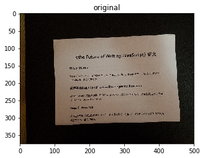
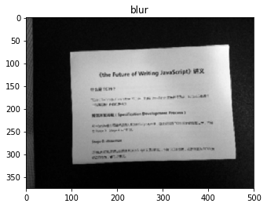
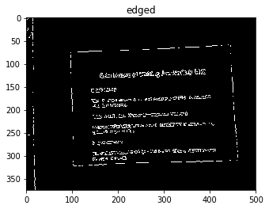
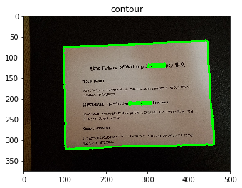
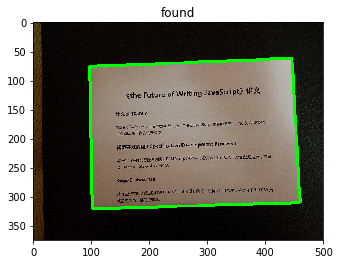
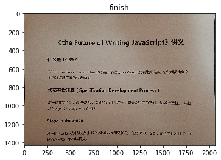
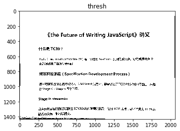
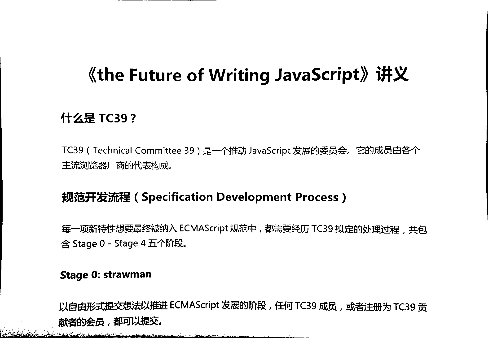

# 利用OpenCV进行文档扫描

很多时候，我们都会需要把一些重要的文件利用扫描仪器扫描的电脑里，方便保持或者通过email发送给别人，但普通人的家里一般是没有扫描仪的，到外面的打印店，不但麻烦还浪费钱。

那有没有一些省力又省钱的做法能，答案当然是肯定的，今天就要和大家分享如何利用opencv来进行文档扫描。同时要非常感谢[pyimagesearch.com](http://www.pyimagesearch.com)，因为本文所使用到的方法，就是出自其[How to Build a Kick-Ass Mobile Document Scanner in Just 5 Minutes](http://www.pyimagesearch.com/2014/09/01/build-kick-ass-mobile-document-scanner-just-5-minutes/)。

首先，我们载入必要的库，同时定义了两个用于在jupyter里显示图片的函数


```python
import numpy as np
import matplotlib.pyplot as plt
import cv2

# 显示彩色图
def imshow(title, img):
    plt.title(title)
    plt.imshow(cv2.cvtColor(img, cv2.COLOR_BGR2RGB))
    plt.show()

# 显示灰度图
def imshow_gs(title, img):
    plt.title(title)
    plt.imshow(img, cmap='gray')
    plt.show()
```

在继续讲述之前，要说明一下，我们这里并不是真的去扫描一个文件，而是利用手机把文件拍下来，然后通过图像处理的方式，转化成一个类似文档扫描的图。例如：


接下来，我们要从文件系统中读入我们事先用手机拍下来的图片，为了提高效率，我们会把图片缩放到500px宽


```python
doc = cv2.imread('doc18.jpg')

h, w, _ = doc.shape
r = 500.0 / w
wn = int(w * r)
hn = int(h * r)

img = cv2.resize(doc, (wn, hn))

imshow('original', img)
```





然后，我们会把图片转化成灰度图，在经过高斯模糊处理后，通过Canny算子进行边界提取


```python
# 灰度
img_gs = cv2.cvtColor(img, cv2.COLOR_BGR2GRAY)
# 高斯模糊，去掉高频信息，方便下面的边界提取
img_blur = cv2.GaussianBlur(img_gs, (5, 5), 0)
# 边界信息提取
img_edged = cv2.Canny(img_blur, 55, 80)

imshow_gs('blur', img_blur)
imshow_gs('edged', img_edged)
```








其实要完成文档扫描的效果，我们这里需要一个假设，那就是需要“扫描”的文档，应该是一个放在图片显眼位置的矩形文件。最好的是除了文件以外，没有其他杂物，背景最好也是干净的。其实要事先这样的假设并不难，只要你找个干净的桌子，把文件往上面放，就可以了。

有了这样的假设，我们在接下来的目标检索就会简单很多。我们首先会根据刚刚提取到的边界信息，找到图片中的轮廓。
接下来，我们会对每个轮廓按所占的面积进行排序（降序）。由于文件是在图片的显眼位置，我们可以认为文章所占的面积已经是比较大的。因此，我们可以取出排序后的前五个面积最大的轮廓，保存下来。


```python
# 查找轮廓
_, contours, _ = cv2.findContours(img_edged, cv2.RETR_LIST, cv2.CHAIN_APPROX_SIMPLE)
# 按照轮廓的面积进行排序，并保存前五名
contours = sorted(contours, key=cv2.contourArea, reverse=True)[:5]

img_tmp = img.copy()

for i in range(len(contours)):
    cv2.drawContours(img_tmp, contours, i, (0, 255, 0), 3)

imshow('contour', img_tmp)    
```





虽然，文件很显眼，但其实我们不能直接hardcode成面积最大的那个轮廓就是文件。相反，我们进一步的通过其他信息来确定哪个轮才是文件。而接下来，我们要使用到的第二个信息就文件是一个矩形，也就是说其轮廓，应该是只有四个顶点的。因此，我们遍历之前找到的那些面积比较大的轮廓，计算他们的顶点数量，如果数量为4，那就是我们要找的目标了。


```python
found = np.zeros((1, 4, 2), dtype=np.int8)

for cnt in contours:
    # 计算轮廓的长度
    peri = cv2.arcLength(cnt, True)
    # 按照轮廓长度的2%作为阈值，检测轮廓的顶点
    aprx = cv2.approxPolyDP(cnt, 0.02 * peri, True)
    
    # 如果顶点数为4，则是一个矩形
    if len(aprx) == 4:
        found = aprx
        break
        
print(found)
```

    [[[446  62]]
    
     [[ 97  76]]
    
     [[102 321]]
    
     [[460 310]]]


我们把，最终找到的那个轮廓描绘出来看看。的确是我们要找的文件


```python
found = np.expand_dims(found, axis=0)

img_tmp = img.copy()

cv2.drawContours(img_tmp, found, 0, (0, 255, 0), 3)

imshow('found', img_tmp)
```





由于已经找文件的轮廓了，下一步就是最重要的一步了，我们需要对图片中的文件进行几何校正，把他旋转放大到占满整个画面。为了完成这一步，我们需要现定义两个函数。第一个函数，是用于对任意四个顶点坐标进行排序，分清他们在一个矩形的哪个位置。而另一个函数，则是利用变换前后对应的两组顶点，求出其变换的矩阵，最后通过矩阵对图片进行透视变换，最后还原成一个正常的没有形变的矩形。


```python
def order_points(pts):
    rect = np.zeros((4, 2), dtype=np.float32)
    
    """
        (0,0)    (2,0)
           +-------+
           |       |
           +-------+
        (0,1)    (2,1)
    """
    # 顶点坐标的和，最大的是右下角的点，最小的是左上角的点
    s = np.sum(pts, axis=1)
    rect[0] = pts[np.argmin(s)]
    rect[2] = pts[np.argmax(s)]
    
    # 顶点坐标之差，最大的是右上角的点，最小的是左下角的点
    d = np.diff(pts, axis=1)
    rect[1] = pts[np.argmin(d)]
    rect[3] = pts[np.argmax(d)]
    
    return rect

def four_point_transform(img, pts):
    src = order_points(pts)
    tl, tr, br, bl = src
    
    # 计算形状的顶宽
    width_t = np.sqrt((tr[0] - tl[0]) ** 2 + (tr[1] - tl[1]) ** 2)
    # 计算形状的底宽
    width_b = np.sqrt((br[0] - bl[0]) ** 2 + (br[1] - bl[1]) ** 2)
    # 把最大宽度作为最后的宽度
    width = max(int(width_t), int(width_b))
    
    # 计算形状的左高
    height_l = np.sqrt((bl[0] - tl[0]) ** 2 + (bl[1] - tl[1]) ** 2)
    # 计算形状的右高
    height_r = np.sqrt((br[0] - tr[0]) ** 2 + (br[1] - tr[1]) ** 2)
    # 把最大的高度作为最后的高度
    height = max(int(height_l), int(height_r))
    
    dst = np.array([
        [0, 0],
        [width - 1, 0],
        [width - 1, height - 1],
        [0, height - 1]
    ], dtype = np.float32)
    
    # 通过变化前后的两组对应的顶点，计算出变化矩阵
    M = cv2.getPerspectiveTransform(src, dst)
    
    # 并利用矩阵对图像进行几何校正
    return cv2.warpPerspective(img, M, (width, height))
```

利用刚刚定义的函数，对图片进行几何校正。校正后，文件已经被放大到占满整个画面。


```python
doc_tr = four_point_transform(doc, found.reshape(4, 2) / r)
imshow('finish', doc_tr)
```





由于是要实现扫描的效果，因此我们还需要对图片进行二值化处理。


```python
doc_gs = cv2.cvtColor(doc_tr, cv2.COLOR_BGR2GRAY)
# 对图像进行二值化处理
_, doc_thresh = cv2.threshold(doc_gs, 90, 255, cv2.THRESH_BINARY)
imshow_gs('thresh', doc_thresh)
```





最后把生成的文件保存一下就可以了。



```python
# 保存图像
cv2.imwrite('doc18_scan.jpg', doc_thresh)
```


    True


